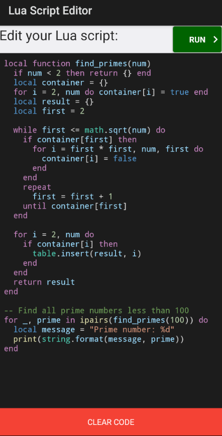

# Lua Script Editor for Android Platforms


A lightweight Lua script editor and runner, built with .NET MAUI in C#, but only intended for Android platforms.

## Example Usage of the App



## Features

- Syntax highlighting for Lua code (keywords, strings, numbers, comments)
- Code execution with output display
- Clean, intuitive interface
- Error handling for script execution
- 5-second execution timeout for safety

## Getting Started

### Prerequisites
- Android device/emulator with API level 24+
- .NET MAUI development environment

### Installation
1. Clone this repository, using the `git clone` command
2. Open in Visual Studio 2022
3. Build and deploy to your Android device/emulator

## Usage

1. Type or paste your Lua code in the editor
2. Tap "Run" to execute the script
3. View output in the results screen
4. Use "Back" to return to editing

# Important Notes  

⚠ **Infinite Loop Protection & Best Practices**  
- Now the app includes a **5-second timeout** to prevent permanent freezes from infinite loops  
- Nevertheless, scripts containing loops without proper exit conditions will:  
  - Freeze the UI temporarily during execution
  - Terminate automatically after 5 seconds
  - Display a timeout error message
- **Recommendation**: Always test loops with small iterations first  
- **Example risky code**:  
  ```lua
  -- WARNING: This will trigger the timeout mechanism
  while true do 
    -- Missing break condition
  end
  ```

## Syntax Highlighting
The editor supports highlighting for:
- Keywords (`if`, `then`, `end`, etc.)
- Built-in functions (`print`, `ipairs`, `tonumber`, etc.)
- Built-in modules (`math`, `table`, `os`, etc.)
- Strings and numbers
- Comments (single-line and multi-line)

## Known Limitations  
- No file operations (save/load) or `input()` functionality
- Limited standard library support (e.g., no `bit32`, restricted `require`)
- Basic error recovery – malformed scripts may produce unclear errors
- No auto-completion or intelligent code suggestions
- Complex scripts may hit timeout before completion

## Contributing
Pull requests are welcome. For major changes, please open an issue first to discuss what you would like to change.

## License
[MIT](https://choosealicense.com/licenses/mit/)

---
**Have a nice day scripting in Lua!** 🚀